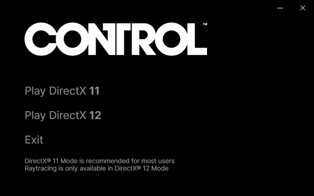

# Control Launcher

I wrote this because Remedy's own launcher requires some ancient .NET version that doesn't come with Windows 10 out of the box and a friend dared me to write a new one.

## Features
* Literally all the features of the original launcher, **plus:**
* The window is draggable
* The app doesn't require several 100 MBs of additional, optional frameworks

## Download
Downloads can be found on the [Releases page](https://github.com/SamusAranX/ControlLauncher/releases).

## Requirements
* [.NET Framework 4.8, which comes preinstalled on reasonably up-to-date versions of Windows 10](https://dotnet.microsoft.com/download/dotnet-framework/net48)

## Screenshots
