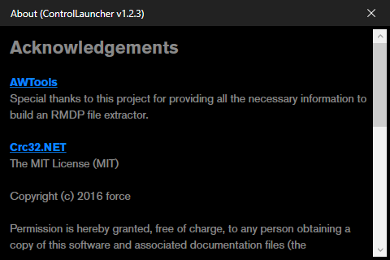

# Control Launcher

I wrote this because Remedy's own launcher requires some ancient .NET version that doesn't come with Windows 10 out of the box and a friend dared me to write a new one.

## Features

* Literally all the features of the original launcher, **plus:**
* The window is draggable
* The window can be minimized
* The app doesn't require several 100 MBs of additional, optional frameworks
* Proper HiDPI support
* Support for keyboard navigation

## Notes for users

Copy the launcher into the game's folder, next to Control_DX11.exe and Control_DX12.exe.
It won't work if it's anywhere else.

## Notes for developers

Before doing anything with this project, go into the Build tab of the project properties and change the Output Path to Control's installation directory.

## Download

Downloads can be found on the [Releases page](https://github.com/SamusAranX/ControlLauncher/releases).

## Requirements

* [.NET Framework 4.8, which comes preinstalled on reasonably up-to-date versions of Windows](https://dotnet.microsoft.com/download/dotnet-framework/net48)

## Screenshots

